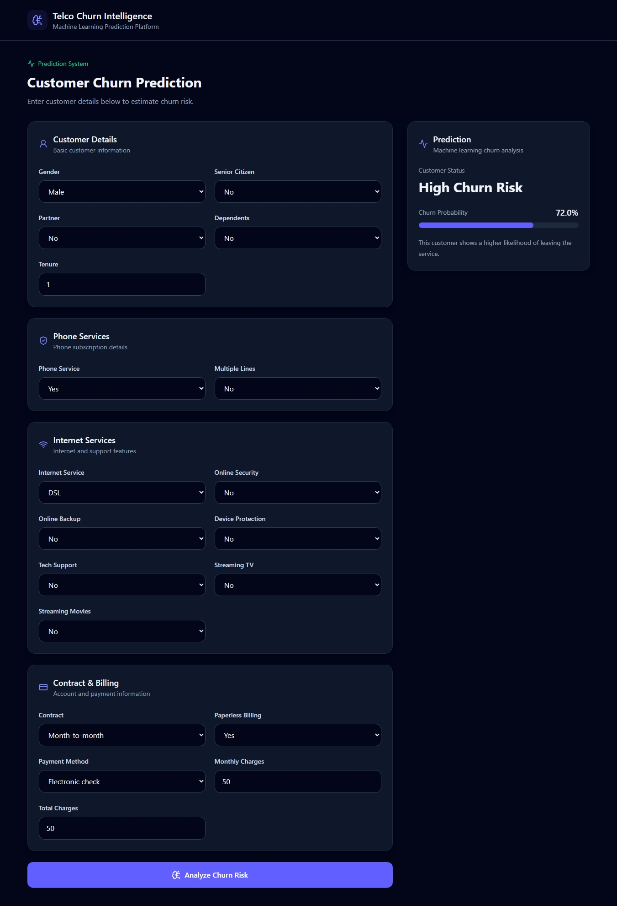
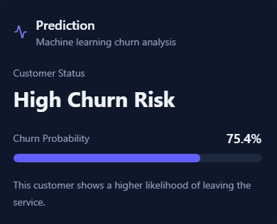

# 📡 Telco Customer Churn Prediction

> **End-to-end machine learning application for predicting telecom customer churn using Scikit-learn, FastAPI, and React.**

This project demonstrates the complete machine learning workflow — from raw customer data and exploratory analysis to model comparison, API development, and an interactive React frontend.

---

## 📑 Table of Contents

- [Project Overview](#-project-overview)
- [Application Preview](#-application-preview)
- [Problem Statement](#-problem-statement)
- [System Architecture](#-system-architecture)
- [Machine Learning Workflow](#-machine-learning-workflow)
- [Model Performance](#-model-performance)
- [Technology Stack](#-technology-stack)
- [Project Structure](#-project-structure)
- [API](#-api)
- [Run Locally](#-run-locally)
- [Key Engineering Features](#-key-engineering-features)
- [Limitations](#-limitations)
- [Future Improvements](#-future-improvements)
- [Detailed Documentation](#-detailed-documentation)
- [Author](#-author)

---

## 🚀 Project Overview

Customer churn is an important business problem for subscription-based companies. Identifying customers who are more likely to leave can help businesses design better retention strategies.

This project builds an **end-to-end churn prediction system** using the Telco Customer Churn dataset.

Rather than stopping at model training inside a Jupyter Notebook, the project converts the trained machine learning pipeline into a usable application.

### The complete workflow includes:

- Exploratory Data Analysis (EDA)
- Data cleaning and feature preparation
- Numerical and categorical preprocessing
- Scikit-learn preprocessing pipelines
- Training three classification algorithms
- Model evaluation and cross-validation
- Model comparison and selection
- Model serialization with Joblib
- REST API development with FastAPI
- Request validation with Pydantic
- React/Vite frontend
- Frontend-to-backend API integration
- Git/GitHub version control

### Models evaluated

1. **Logistic Regression**
2. **Random Forest**
3. **Gradient Boosting**

---

## 🖥️ Application Preview

The React interface allows a user to enter customer information and receive a churn-risk prediction from the trained ML model.



### Prediction output

The application returns:

- Customer churn prediction
- Churn probability
- Visual risk indicator



> Screenshots should be added to `docs/images/` before finalizing the portfolio repository.

---

## 🎯 Problem Statement

The objective is to predict whether a telecommunications customer is likely to discontinue the company's services.

The target variable is:

```text
Churn
```

It represents a binary classification problem:

```text
No  → Customer stays
Yes → Customer churns
```

For model training:

```text
No  → 0
Yes → 1
```

The model uses customer information such as:

- Tenure
- Contract type
- Internet service
- Phone service
- Technical support
- Online security
- Streaming services
- Payment method
- Monthly charges
- Total charges
- Demographic information

---

## 🏗️ System Architecture

```text
Customer
   │
   ▼
React / Vite Frontend
   │
   │  JSON POST /predict
   ▼
FastAPI Backend
   │
   ▼
Pydantic Validation
   │
   ▼
Pandas DataFrame
   │
   ▼
Scikit-learn Pipeline
   │
   ├── Numerical Preprocessing
   │     ├── Missing-value imputation
   │     └── StandardScaler
   │
   ├── Categorical Preprocessing
   │     ├── Missing-value imputation
   │     └── OneHotEncoder
   │
   ▼
Trained Classifier
   │
   ▼
Prediction + Churn Probability
   │
   ▼
React Result Dashboard
```

A major design decision was to save the **complete Scikit-learn pipeline**, rather than only the classifier. This ensures that production input receives the same preprocessing used during training.

---

## 🧠 Machine Learning Workflow

### 1. Data Exploration

The dataset was inspected for:

- Data types
- Missing values
- Class distribution
- Numerical statistics
- Categorical values
- Relationships between customer characteristics and churn

### 2. Data Cleaning

`TotalCharges` required conversion from an object/string representation to a numerical feature.

```python
df["TotalCharges"] = pd.to_numeric(
    df["TotalCharges"],
    errors="coerce"
)
```

`customerID` was removed because it is an identifier rather than a meaningful predictive feature.

### 3. Preprocessing

Numerical features use:

```text
SimpleImputer
      ↓
StandardScaler
```

Categorical features use:

```text
SimpleImputer
      ↓
OneHotEncoder
```

Both pipelines are combined with:

```text
ColumnTransformer
```

### 4. Model Training

Three different algorithm families were compared:

| Model | Type |
|---|---|
| Logistic Regression | Linear classifier |
| Random Forest | Bagging/tree ensemble |
| Gradient Boosting | Boosting/tree ensemble |

### 5. Cross-Validation

Models were evaluated using **5-fold cross-validation** with F1-score as the primary comparison metric.

F1-score was emphasized because churn prediction contains class imbalance, making accuracy alone insufficient for evaluating model quality.

---

## 📊 Model Performance

### Cross-Validation Results

| Model | Mean CV F1 | CV Std |
|---|---:|---:|
| **Logistic Regression** | **0.5987** | 0.0099 |
| Gradient Boosting | 0.5863 | **0.0096** |
| Random Forest | 0.5482 | 0.0165 |

### Key observation

**Logistic Regression achieved the highest mean cross-validation F1-score among the three baseline models.**

Gradient Boosting performed competitively and showed slightly lower variation across folds, while Random Forest produced the lowest mean F1-score.

This experiment also demonstrates an important ML principle:

> **A more complex model does not automatically produce better results.**

Model selection considers not only raw performance but also stability, interpretability, complexity, and suitability for deployment.

> Additional test-set metrics and ROC-AUC results are available in the project reports/notebooks.

---

## 🛠️ Technology Stack

### Machine Learning


- Python
- Pandas
- NumPy
- Scikit-learn
- Joblib
- Jupyter Notebook

### Backend


- FastAPI
- Pydantic
- Uvicorn

### Frontend


- React
- Vite
- Tailwind CSS
- Lucide React

### Development

- Git
- GitHub
- Visual Studio Code

---

## 📁 Project Structure

```text
Telco-churn-ML-application/
│
├── backend/
│   ├── main.py
│   └── schemas.py
│
├── frontend/
│   ├── public/
│   ├── src/
│   │   ├── components/
│   │   │   └── CustomerForm.jsx
│   │   ├── App.jsx
│   │   ├── index.css
│   │   └── main.jsx
│   ├── package.json
│   └── vite.config.js
│
├── data/
│   └── raw/
│
├── notebooks/
│   ├── 01_data_exploration.ipynb
│   ├── 02_logistic_regression.ipynb
│   ├── 03_random_forest.ipynb
│   ├── 04_gradient_boosting.ipynb
│   └── 05_model_comparison.ipynb
│
├── models/
│   └── best_model.joblib
│
├── reports/
│   ├── model_results.csv
│   ├── cross_validation_results.csv
│   └── figures/
│
├── src/
│   ├── preprocessing.py
│   ├── evaluate.py
│   └── predict.py
│
├── docs/
│   ├── PROJECT_DOCUMENTATION.md
│   └── images/
│
├── .gitignore
├── requirements.txt
└── README.md
```

---

## ⚡ API

The trained model is exposed through a FastAPI REST API.

### Main endpoints

| Method | Endpoint | Purpose |
|---|---|---|
| `GET` | `/` | API information |
| `GET` | `/health` | Health check |
| `POST` | `/predict` | Generate churn prediction |

### Example prediction request

```json
{
  "gender": "Male",
  "SeniorCitizen": 0,
  "Partner": "Yes",
  "Dependents": "No",
  "tenure": 12,
  "PhoneService": "Yes",
  "MultipleLines": "No",
  "InternetService": "Fiber optic",
  "OnlineSecurity": "No",
  "OnlineBackup": "Yes",
  "DeviceProtection": "No",
  "TechSupport": "No",
  "StreamingTV": "Yes",
  "StreamingMovies": "Yes",
  "Contract": "Month-to-month",
  "PaperlessBilling": "Yes",
  "PaymentMethod": "Electronic check",
  "MonthlyCharges": 89.50,
  "TotalCharges": 1074.00
}
```

### Example response

```json
{
  "prediction": 1,
  "churn_probability": 0.74
}
```

The React frontend consumes this endpoint and converts the response into a user-friendly churn-risk display.

---

## 💻 Run Locally

### Prerequisites

Make sure you have installed:

- Python 3
- Node.js
- npm
- Git

### 1. Clone the repository

```bash
git clone https://github.com/tahirsaeedtech-stack/Telco-churn-ML-application.git
cd Telco-churn-ML-application
```

### 2. Create a Python virtual environment

```bash
python -m venv .venv
```

Activate it on Windows:

```powershell
.\.venv\Scripts\Activate.ps1
```

### 3. Install Python dependencies

```bash
pip install -r requirements.txt
```

### 4. Start FastAPI

From the project root:

```bash
python -m uvicorn backend.main:app --reload
```

Backend:

```text
http://127.0.0.1:8000
```

Swagger API documentation:

```text
http://127.0.0.1:8000/docs
```

### 5. Configure the frontend

Create:

```text
frontend/.env
```

Add:

```env
VITE_API_URL=http://127.0.0.1:8000
```

### 6. Start React

Open another terminal:

```bash
cd frontend
npm install
npm run dev
```

On Windows PowerShell, if `npm` script execution is blocked:

```powershell
npm.cmd install
npm.cmd run dev
```

The frontend normally runs at:

```text
http://localhost:5173
```

---

## ⚙️ Key Engineering Features

This project demonstrates more than model training.

### Reusable ML preprocessing

Preprocessing is implemented using Scikit-learn pipelines instead of manually transforming production data.

### Consistent training and inference

The complete preprocessing + classifier pipeline is serialized using Joblib.

### API validation

FastAPI and Pydantic validate customer input before model inference.

### Frontend/backend separation

React handles presentation and user interaction, while FastAPI handles prediction logic.

### Environment-based API configuration

The frontend uses:

```text
VITE_API_URL
```

so development and future production backend addresses can be configured independently.

### Reproducible structure

Model experiments, production code, saved artifacts, reports, backend code, and frontend code are separated into dedicated directories.

---

## ⚠️ Limitations

This project is designed as an ML engineering and portfolio application rather than a production telecom decision system.

Current limitations include:

- The training dataset represents a limited historical customer population.
- Customer behavior may differ across telecom companies, locations, and time periods.
- Churn probability represents model-estimated risk, not certainty.
- Production model-drift monitoring is not currently implemented.
- Automatic retraining is not implemented.
- Business costs associated with false positives and false negatives have not yet been incorporated into threshold selection.

The model should therefore be treated as a **decision-support demonstration**, not an autonomous customer-management system.

---

## 🔮 Future Improvements

Potential extensions include:

- SHAP-based prediction explanations
- Hyperparameter optimization
- Classification-threshold optimization
- Probability calibration
- Feature-importance visualization
- Automated model testing
- Docker containerization
- CI/CD
- MLflow experiment tracking
- Model/data drift monitoring
- Cloud deployment
- Automated retraining

These features are intentionally outside the first version so that the project remains focused on a clean, understandable end-to-end ML workflow.

---

## 📚 Detailed Documentation

This README provides a recruiter-friendly overview of the project.

For the complete technical explanation covering data preprocessing, individual model development, evaluation methodology, backend architecture, frontend integration, design decisions, limitations, and future development, see:

➡️ **[Full Project Documentation](docs/PROJECT_DOCUMENTATION.md)**

The Jupyter notebooks provide the underlying experimentation and model-development work:

```text
notebooks/
├── 01_data_exploration.ipynb
├── 02_logistic_regression.ipynb
├── 03_random_forest.ipynb
├── 04_gradient_boosting.ipynb
└── 05_model_comparison.ipynb
```

---

## 👨‍💻 Author

**Tahir Saeed**

GitHub:  
https://github.com/tahirsaeedtech-stack

Project Repository:  
https://github.com/tahirsaeedtech-stack/Telco-churn-ML-application

---

## ⭐ Project Status

**Portfolio Version:** `v1.0.0`

Core ML development, FastAPI integration, React frontend, and local end-to-end functionality are complete.

Production deployment is planned after completion of the broader ML portfolio.

---

### If you found this project useful, consider giving the repository a ⭐.